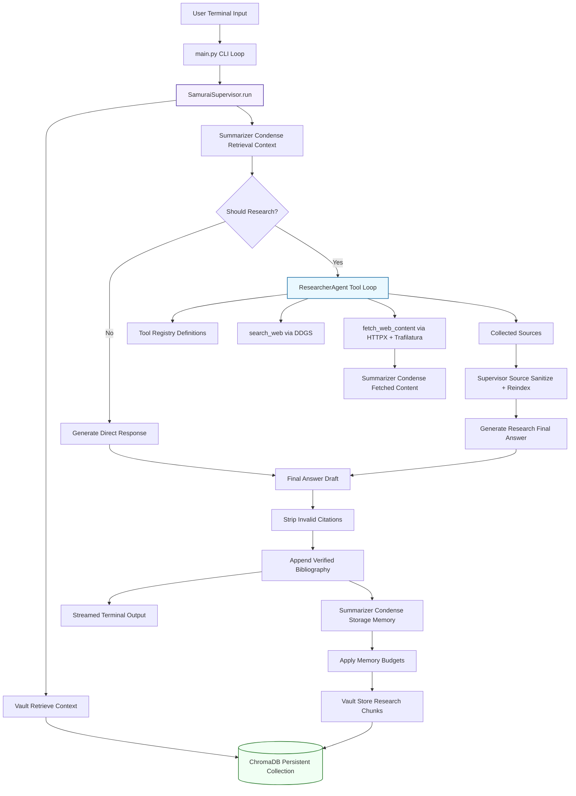

# 09. Architecture Diagram

This page provides a visual map of the runtime architecture and request lifecycle.

## End-to-End Flow

## Key Boundaries

- Orchestration boundary: `SamuraiSupervisor` is the single control plane for routing, memory, and source policy.
- Research boundary: `ResearcherAgent` performs tool-calling and source gathering only.
- Compression boundary: `SummarizerAgent` is used for context and memory compaction.
- Persistence boundary: `MemoryVault` owns vector ingestion and retrieval.

## Policy Enforcement Points

- Research routing gate: decides direct answer vs external research mode.
- Source validation gate: removes invalid or duplicate sources and reindexes citation IDs.
- Citation cleanup gate: strips references that do not map to validated sources.
- Memory budget gate: caps storage and retrieval payload sizes by lines and characters.

## Diagram Notes

- The direct path and research path converge before final citation cleanup.
- Storage writes occur after final synthesis and memory summarization.
- Retrieval and storage both pass through summarization to keep context high signal.
